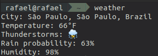

# WeatherPy 🌤

[Python3+](https://www.python.org/downloads/) is required to run this app.

`WeatherPy` is a [cli](https://en.wikipedia.org/wiki/Command-line_interface) weather app for Linux.


## Installation ✏️
  
```
git clone https://github.com/rf-ferreira/weatherpy-cli
cd weatherpy-cli
chmod +x ./install
sudo ./install
```

## How to use
**EN:**<br>
Use `weather` command on terminal.

**PT:**<br>
Também é possível usar o commando `clima` no terminal.

## Commands
**Usecase:**
```
weather `<command>` `<option>`
```
**`lang`**: Change the language to provided language. <br>
Options: `en: English`, `pt: Portuguese`.
```
weather lang en
```

**`temp-scale`**: Change the temperature scale. <br>
Options: `c: Celsius`, `f: Fahrenheit`.
```
weather temp-scale f
```

**`city`**: Change the city. <br>
Options: `City Name`.
```
weather city "São Paulo"
```

**`reset`**: Reset the `config.py` file information. <br>
Options: __No option__.
```
weather reset
```

## Showcase

